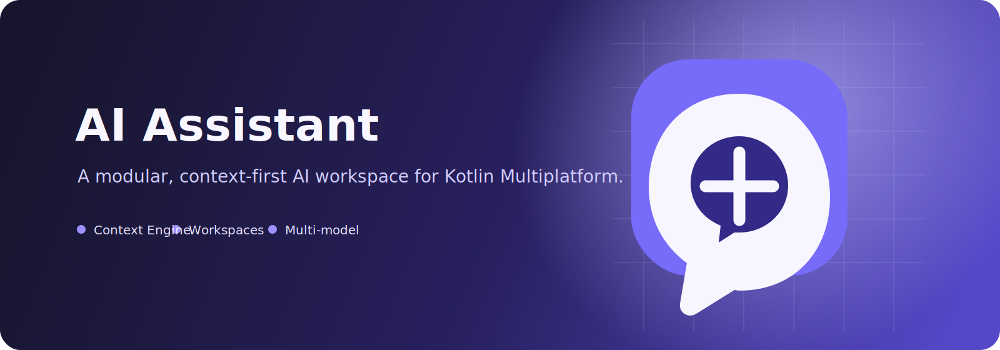

<p align="center">
  
</p>

<p align="center">
  
</p>

<h1 align="center">AI Assistant</h1>

<p align="center">A context-first, modular AI workspace built with Kotlin Multiplatform.</p>

<p align="center">
  <a href="#supported-platforms">Kotlin Multiplatform</a> ·
  <a href="#modular-architecture">Context Engine</a> ·
  <a href="#mvp-status">MVP</a> ·
  <a href="README.zh-CN.md">中文文档</a>
</p>

AI Assistant combines multi-model chat, workspace-scoped context, prompt composition, memory, and file attachments in an architecture designed for future RAG, MCP tools, and agents.

## Modular Architecture

> Design principle: Chat is only one context consumer. New capabilities enter through feature contracts and ordered context providers instead of being wired directly into a screen.

The project is being migrated from a single `shared` module to independent KMP modules. Each module exposes only cross-platform contracts from `commonMain`; database drivers, HTTP engines, file access, and UI integrations remain in platform source sets.

```
core                 # Shared contracts and context primitives
database             # SQLDelight schema, migrations and platform drivers
feature-chat         # Conversation and message use cases
feature-prompt       # Context Engine and prompt providers
feature-memory       # Recent, summary and long-term memory
feature-model        # Provider abstractions and model configuration
feature-files        # File metadata and attachment pipeline
feature-workspace    # Workspace-scoped context
feature-settings     # User preferences and themes
feature-knowledge    # V2: RAG contracts and indexing
feature-tools        # V2: tool and MCP contracts
feature-agent        # V2: planning and execution contracts
composeApp           # Compose Multiplatform application shell
```

`shared` is a temporary compatibility bridge while existing implementations are migrated module by module. New features must not be added there.

`core` and `database` are already migrated: message/provider primitives live in `core`; the SQLDelight schema, migrations and Android/JVM/iOS database drivers live in `database`.

`feature-model` owns provider contracts, the OpenAI-compatible streaming adapter, API key persistence and platform Ktor engines.

`feature-workspace` owns workspace creation, selection, workspace instructions and the default personal workspace.

`feature-memory` owns scoped recall and the model-backed conversation summary policy.

`feature-files` owns portable attachment metadata; platform file pickers stay in the Compose application layer.

`feature-prompt` owns the Context Engine, ordered prompt providers and reusable prompt templates.

`feature-chat` owns conversation/message persistence; `feature-settings` owns persisted theme preferences.

The application shell uses Decompose as its primary routing framework. Feature screens receive navigation callbacks from a root component instead of directly controlling a navigator.

## MVP Status

- [x] Streaming chat, stop, regenerate and continue
- [x] Provider/API key switching and model selection
- [x] Context Engine: system, template, workspace, memory, file manifest and recent history
- [x] Workspace-scoped conversations
- [x] Conversation file attachments (PDF, Office, Markdown, text, and images)
- [x] Persisted system/light/dark theme
- [x] Summary-memory service (configured at 500 messages)
- [ ] Markdown renderer, rich message types, and edit/retry controls
- [ ] File content extraction, OCR, vision and RAG indexing
- [ ] Knowledge, tools/MCP, and agent execution (V2)

## Quality Gates

- Detekt is applied to every Gradle module with shared configuration at `config/detekt/detekt.yml`.
- Kover is applied to `composeApp` for JVM coverage reporting. The coverage report task is available once JVM tests are added; unit tests are intentionally not a delivery gate during the current architecture migration.

## Supported Platforms

- Desktop (JVM) via Compose Multiplatform
- Android via Compose Multiplatform
- iOS via Compose Multiplatform
- Server via Ktor

## Supported AI Providers

- OpenAI (GPT-4o, etc.)
- DeepSeek (deepseek-chat, etc.)
- Google Gemini (gemini-2.0-flash, etc.)
- Anthropic Claude (claude-3-5-sonnet, etc.) - ChatProvider interface ready, implementation pending
- OpenRouter
- Ollama (local)
- Custom (any OpenAI-compatible endpoint)

## Features

### Chat
- Multi-turn conversation with streaming responses
- Stop generation
- Regenerate last response
- Continue generation
- Conversation list with search, pin, archive, delete

### Multi-Provider
- Add/Delete/Switch API keys
- Import/Export API keys
- Provider-specific base URL and model configuration

### Chat History
- Search conversations
- Pin important conversations
- Archive old conversations
- Delete conversations

### Database
- SQLDelight for persistent storage
- Conversation table (id, title, providerType, model, timestamps, pin/archive flags)
- ChatItem table (message storage with conversation association)
- ApiKey table (secure storage with provider configuration)

## Architecture

```
┌─────────────────────────────────────────────────┐
│                  composeApp                      │
│  ┌──────────┐  ┌──────────────┐  ┌───────────┐ │
│  │AIChat-   │  │AISettings-   │  │LoginPage  │ │
│  │Screen    │  │Screen        │  │           │ │
│  └────┬─────┘  └──────┬───────┘  └───────────┘ │
│       │               │                         │
│  ┌────┴───────────────┴──────────────────────┐  │
│  │          AIChatViewModel                   │  │
│  └────────────────┬──────────────────────────┘  │
└───────────────────┼─────────────────────────────┘
                    │
┌───────────────────┼─────────────────────────────┐
│               shared                             │
│  ┌────────────────┴──────────────────────────┐  │
│  │          ChatProvider (interface)          │  │
│  │  ┌──────────────────────────────────┐     │  │
│  │  │ OpenAICompatibleProvider          │     │  │
│  │  │ (OpenAI, DeepSeek, OpenRouter,   │     │  │
│  │  │  Ollama, Custom)                 │     │  │
│  │  └──────────────────────────────────┘     │  │
│  └────────────────┬──────────────────────────┘  │
│                   │                              │
│  ┌────────────────┴──────────────────────────┐  │
│  │  ChatRepository    ApiKeyRepository       │  │
│  └────────────────┬──────────────────────────┘  │
│                   │                              │
│  ┌────────────────┴──────────────────────────┐  │
│  │          WatsonDatabase (SQLDelight)       │  │
│  └───────────────────────────────────────────┘  │
└─────────────────────────────────────────────────┘
```

## Project Structure

```
├── composeApp/
│   └── src/
│       ├── commonMain/kotlin/org/example/project/
│       │   ├── ai/              # AI Assistant screens
│       │   │   ├── AIChatScreen.kt
│       │   │   └── AISettingsScreen.kt
│       │   ├── viewmodel/
│       │   │   └── AIChatViewModel.kt
│       │   ├── di/
│       │   │   └── appModule.kt
│       │   ├── components/
│       │   │   └── CommonTopAppBar.kt
│       │   ├── App.kt
│       │   └── LoginPage.kt
│       ├── androidMain/          # Android entry
│       ├── iosMain/              # iOS entry
│       └── jvmMain/              # Desktop entry
├── shared/
│   └── src/
│       └── commonMain/
│           ├── kotlin/org/example/project/
│           │   ├── chat/         # Provider abstraction
│           │   │   ├── ChatProvider.kt
│           │   │   ├── ChatMessage.kt
│           │   │   ├── ProviderType.kt
│           │   │   └── OpenAICompatibleProvider.kt
│           │   ├── repo/         # Repositories
│           │   │   ├── ChatRepository.kt
│           │   │   └── ApiKeyRepository.kt
│           │   ├── database/     # Database
│           │   │   └── DatabaseModule.kt
│           │   ├── bean/         # Data classes
│           │   ├── di/           # DI modules
│           │   └── network/      # HTTP client
│           └── sqldelight/       # SQLDelight schema
│               └── Watson.sq
├── server/                       # Ktor server
└── iosApp/                       # iOS Xcode project
```

## Build and Run

### Desktop (JVM)
```shell
./gradlew :composeApp:run
```

### Server
```shell
./gradlew :server:run
```

### Android
```shell
./gradlew :composeApp:assembleDebug
```

### iOS
Open `iosApp/` in Xcode and run.

## Configuration

### Adding an API Key
1. Launch the app
2. Navigate to Settings from the sidebar
3. Click "+ Add Key"
4. Select your provider (OpenAI, DeepSeek, Gemini, etc.)
5. Enter your API key, customize base URL and model if needed
6. The key will be set as active automatically

### Using a Custom Provider
Select "Custom" as provider type and enter your own base URL that follows the OpenAI API format (`/v1/chat/completions` endpoint).

## Dependencies

| Category | Library | Version |
|----------|---------|---------|
| UI | Compose Multiplatform | 1.9.0 |
| Language | Kotlin | 2.2.20 |
| DI | Koin | 4.1.1 |
| HTTP | Ktor Client | 3.3.1 |
| DB | SQLDelight | 2.1.0 |
| Navigation | Voyager | 1.1.0-beta03 |
| Images | Coil | 3.3.0 |
| Server | Ktor Server | 3.3.0 |
