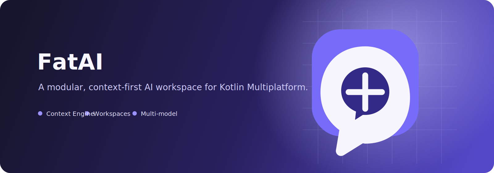

<p align="center">
  
</p>

<p align="center">
  
</p>

<h1 align="center">FatAI</h1>

<p align="center">一个以明确 Context 管线为核心、基于 Kotlin Multiplatform 构建的 AI 工作台。</p>

<p align="center">
  <a href="#模块状态">模块状态</a> ·
  <a href="#当前可用能力">当前可用能力</a> ·
  <a href="#上下文管线">Context 管线</a> ·
  <a href="README.md">English</a>
</p>

FatAI 是一个仍在持续建设中的 AI Assistant。项目采用 KMP Feature Module 划分 Chat、Prompt、Memory、File、Workspace、Model、Knowledge、Tools 与 Agent，使后续能力能够独立演进。本文只描述仓库中已经存在的代码与能力，不把规划功能写成已完成能力。

## 支持目标平台

- Android
- Desktop JVM
- iOS（`iosArm64`、`iosSimulatorArm64`）
- 项目保留了一个 Ktor Server 示例模块；它不是 AI 代理或 AI 后端。

应用 UI 使用 Compose Multiplatform。SQLDelight Driver 与 Ktor Engine 分别放在平台 Source Set，领域模型与 Feature API 放在 `commonMain`。

## 模块状态

| 模块 | 当前实现 | 状态 |
| --- | --- | --- |
| `core` | `ChatItemType`、`MessageContentType`、Provider 类型和聊天基础模型。 | 已实现 |
| `database` | SQLDelight Schema、Android/JVM/iOS Driver，以及截至版本 7 的迁移。 | 已实现 |
| `feature-user` | 当前用户抽象、默认本地用户初始化与数据归属边界。 | 已实现；登录与账号切换待接入 |
| `feature-chat` | 会话与消息仓库：创建、列表、搜索、置顶、归档、删除、消息持久化与更新。 | 已实现 |
| `feature-prompt` | 有序 `ContextEngine`、系统/模板/工作区/记忆/文件/历史 Provider，以及 Prompt Template 持久化。 | 已实现；暂无模板管理页面 |
| `feature-memory` | Global/Workspace/Conversation 范围的记忆保存与召回；500 条消息时的模型摘要服务。 | 已实现；暂无语义检索与记忆管理页面 |
| `feature-model` | `ChatProvider` 契约、`ModelGateway`、API Key 仓库、Ktor Client 与一个 OpenAI-compatible 流式适配器。 | 已实现 OpenAI-compatible Endpoint |
| `feature-files` | 跨平台附件元数据、待发送附件到消息的绑定与持久化。 | 已实现；内容提取待完成 |
| `feature-workspace` | 默认 Personal 工作区、创建/选择/更新/归档仓库操作与工作区指令。 | 已实现；编辑与归档 UI 待完成 |
| `feature-settings` | 跟随系统/浅色/深色主题的持久化。 | 已实现 |
| `feature-knowledge` | 仅有 Gradle/KMP 模块骨架。 | 未实现 |
| `feature-tools` | 仅有 Gradle/KMP 模块骨架。 | 未实现 |
| `feature-agent` | 仅有 Gradle/KMP 模块骨架。 | 未实现 |
| `shared` | 在迁移期间提供 Koin 装配与平台启动兼容层。 | 兼容层；不要加入新的 Feature 逻辑 |
| `composeApp` | Decompose 根路由、Chat/Settings UI、资源、平台入口与响应式布局。 | 已实现 |

Knowledge、Tools、Agent 模块已经被纳入项目结构，但当前没有领域契约或运行时实现，因此这里只标注为骨架，不将其表述为产品能力。

## 当前可用能力

### Chat 与界面

- Open WebUI 风格的响应式布局：桌面端固定侧栏，移动端抽屉导航。
- 会话创建、搜索、置顶、归档、删除、首条消息自动生成标题；进入聊天页时会恢复最近一次保存的会话及消息。
- SSE 流式回复、停止生成、重新生成与续写。
- 流式请求期间显示带动画的“正在思考”。
- 助手 Markdown 渲染：GFM 表格、链接、代码块，以及面向手机的字号。
- 使用 Decompose 在 Chat 与 Settings 间进行栈式导航。
- `AppSetting` 持久化跟随系统/浅色/深色主题；设置页通过带选中态的弹窗切换主题。
- 英文与中文 Compose 资源随系统语言选择。
- 首次没有 API 密钥时，应用会阻止聊天并引导用户前往设置完成配置；侧栏底部展示当前用户的头像和用户名。

### 文件与多模态消息展示

- 通过 FileKit 选择 PDF、Office、Markdown、文本和常见图片格式。
- 待发送附件单独保存，发送时绑定到对应用户消息。
- 已发送图片通过 FileKit 的 KMP 图片集成在聊天中预览；非图片附件显示为文件卡片。
- 重新打开会话后，附件仍会出现在原始消息下。

目前附件只会以文件清单（文件名、MIME Type、大小）加入模型上下文。项目尚未向模型 Provider 上传文件字节、提取 PDF/文本内容、进行 OCR，或发送 Vision Message Part。

### 模型访问

- 添加、激活、删除 API Key 配置，并设置 Provider、Base URL、Model。
- 当前激活的配置用于流式聊天请求；新增或切换密钥后，无需重启应用即可新建会话。
- 已实现的传输层使用 OpenAI Chat Completions SSE 形状：`POST {baseUrl}/chat/completions`。

当 Endpoint 兼容 OpenAI Chat Completions 时，可配置 OpenAI、DeepSeek、OpenRouter、Ollama 和 Custom。Gemini、Claude 当前仅出现在 Provider 下拉选择中作为配置预设；专用 Gemini/Anthropic Adapter 尚未实现，因此并不支持它们的原生 API。API Key 当前保存在本地 SQLDelight 数据库，尚未接入各平台的安全密钥存储。

## 上下文管线

每次发送聊天请求时，`feature-prompt` 会按照固定顺序组装上下文：

```text
系统提示词
  → 已启用的 Prompt Template
  → 当前工作区指令
  → 召回的记忆
  → 当前会话的文件清单
  → 最近 20 条聊天记录
  → OpenAI-compatible Model Gateway
```

`PromptProvider` 是扩展点。后续的 RAG、MCP 工具结果或 Agent State 都可以以 Provider 的形式接入，无需和聊天页面直接耦合。

### Memory

`MemoryEntry` 支持 `GLOBAL`、`WORKSPACE`、`CONVERSATION` 三个 Scope，以及 `FACT`、`SUMMARY` 两种 Kind。当前通过 SQL 查询最多召回 20 条记忆。会话完成后，如果消息数恰好达到 500 的倍数，`ConversationMemoryService` 会请求当前模型生成摘要并将其保存为 Conversation Scope 的 Memory。

当前没有 Embedding、向量数据库、语义召回、去重机制，也没有记忆的新建、审核和管理界面。

### 多模态消息模型

`ChatItemType` 表示发送方（`Question` 或 `Answer`），`MessageContentType` 表示正文载体（`Text`、`Markdown`、`Image`、`File`、`ToolResult`、`Thinking`）。`ChatItem.contentType` 已持久化（迁移 4）。

`FileAsset` 是消息附件的旁路实体。新附件的 `messageId` 为 null；发送时通过迁移 5 添加的字段绑定到刚创建的用户消息。UI 按 `messageId` 分组，因此图片预览与文件卡片会始终属于正确的聊天气泡。目前聊天流程只会产生用户 `Text` 与助手 `Markdown`；其余内容类型为后续渲染器预留。

## 架构

项目的 Kotlin 包命名空间与 Android module namespace 统一为 `ai.fatai`；Android applicationId 和 iOS bundle identifier 使用 `ai.fatai.app`。发布前请按组织实际拥有的域名调整该标识。

```text
composeApp（Compose UI、Decompose 根路由、响应式页面）
        │
        ├── shared（临时 Koin 装配与平台启动桥接）
        │      ├── feature-user / feature-chat / feature-model / feature-prompt
        │      ├── feature-memory / feature-files / feature-workspace
        │      └── feature-settings
        │
        ├── core（跨模块基础模型）
        └── database（SQLDelight Schema、迁移、平台 Driver）

feature-knowledge / feature-tools / feature-agent
        └── 为 V2 预留的 KMP 骨架
```

`composeApp` 是应用壳，不是 Feature Module。当前 `shared` 仍承担 Koin 装配职责，直至历史 shared 模块完全退出。新增领域行为应放入对应的 `feature-*` 模块。

## 多语言与品牌资源

Compose 可见文案位于：

- 英文：`composeApp/src/commonMain/composeResources/values/strings.xml`
- 中文：`composeApp/src/commonMain/composeResources/values-zh/strings.xml`

Android 应用名称保留在 `composeApp/src/androidMain/res/values*`。iOS 原生字符串表在 `iosApp/iosApp/{en,zh-Hans}.lproj/`。品牌源文件为 `assets/branding/fatai-icon.svg` 与 `assets/branding/fatai-banner.svg`。

## 数据持久化

SQLDelight 保存用户、会话、消息、Provider 配置、工作区、记忆、Prompt Template、文件附件和 App 设置。所有业务数据都带有 `userId`，仓库的读写操作均按当前用户过滤。当前启动时会自动创建 `local-default` 默认本地用户，并将迁移前的已有数据归属给该用户；未来接入登录时只需替换 `CurrentUserProvider` 的实现。桌面端数据库位于 `~/.fatai/app.db`；首次启动时如果存在旧的 `~/.ai-assistant/app.db`，会将其复制过来。桌面端会持久化 SQLDelight schema 版本，并识别旧版未记录版本号的本地库后安全迁移。Android 与 iOS 使用各自的 SQLDelight Driver。

## 构建与运行

```shell
# Desktop
./gradlew :composeApp:run

# Android APK
./gradlew :composeApp:assembleDebug

# KMP 编译检查
./gradlew :composeApp:compileKotlinJvm
./gradlew :composeApp:compileDebugKotlinAndroid
./gradlew :composeApp:compileKotlinIosSimulatorArm64

# Ktor Server 示例
./gradlew :server:run
```

iOS 请使用 Xcode 打开 `iosApp/` 后运行。

## 质量门禁

- Detekt 已应用到所有 Gradle 子项目，配置位于 `config/detekt/detekt.yml`。
- Kover 已应用到 `composeApp`，用于 JVM 覆盖率报告。
- 当前只有最小测试骨架，尚未将 UT 作为交付门禁；架构迁移阶段以编译检查为主要验证手段。

## 关键依赖

| 领域 | 库 |
| --- | --- |
| UI | Compose Multiplatform 1.9.0 / Material 3 |
| 路由 | Decompose 3.3.0 |
| DI | Koin 4.1.1 |
| 网络 | Ktor Client 3.3.1 |
| 持久化 | SQLDelight 2.1.0 |
| 文件与图片 | FileKit 0.12.0、Coil 3.3.0 |
| Markdown | multiplatform-markdown-renderer-m3 0.37.0 |
